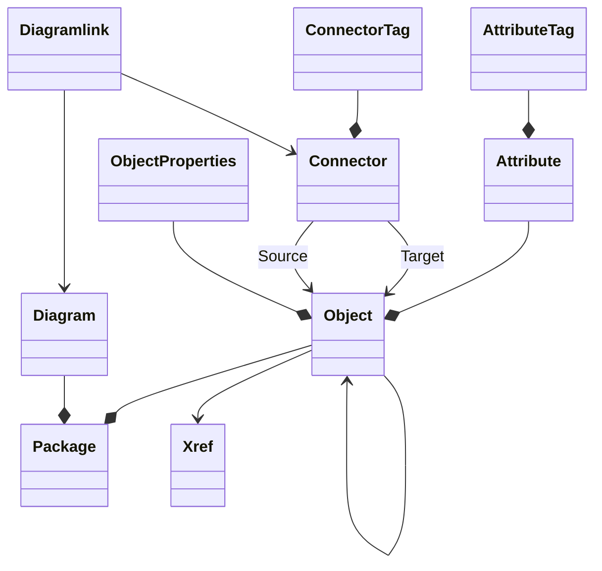

## Model

```mermaid

classDiagram

Object --* Package
Object --> Xref
Attribute --* Object
AttributeTag --* Attribute
Object --> Object
Diagram --* Package
Diagramlink --> Diagram
Connector --> Object : Target
Connector --> Object : Source
ConnectorTag --* Connector
Diagramlink --> Connector
ObjectProperties --* Object


```

See : https://github.com/avzdk/sparx/tree/main/Documentation